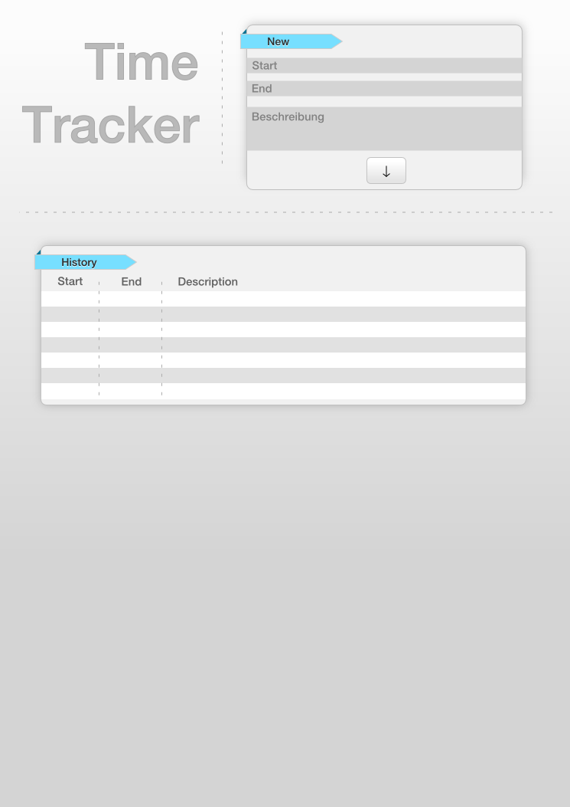
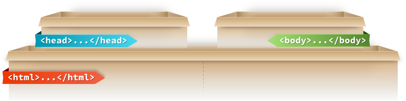
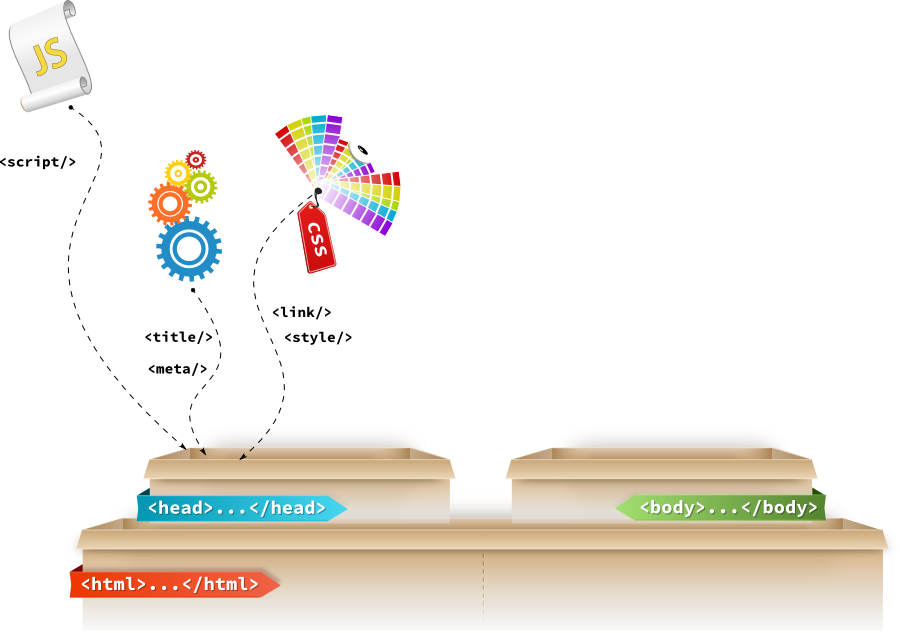
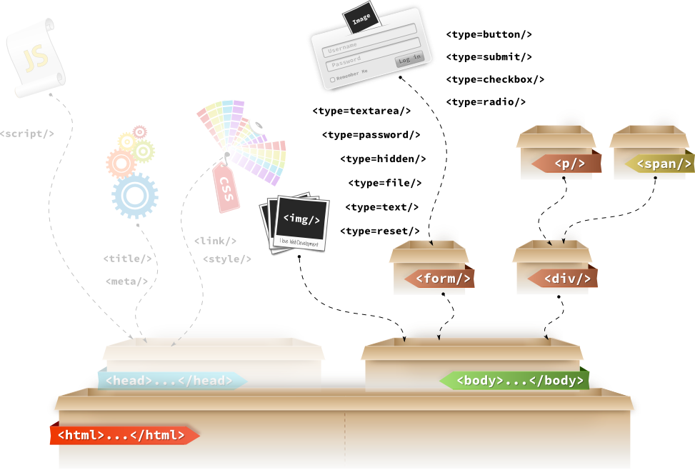

# Web Ninja Workshop - Basics

## Agenda

* Git
* HTML
* CSS
* JS
* Node.JS
* Ajax
* Wireshark
* Browser / Dev Tools
* Links

## Ablauf

## Git

### Was ist Git?

* Dezentrales Versionverwaltungssystem
* Kommandozeilenwerkzeug
* [SetUp](https://help.github.com/articles/set-up-git)
* [Einleitung](http://rogerdudler.github.com/git-guide/index.de.html)

### Beispiel - TimeTracker

* Maske fuer die Erfassung von Zeiten
* Vorlage (Inkscape)

* Jeder erweitert die README.md mit etwas Inhalt ueber die TimeTracker-App

## Github

### Was ist Github?

* Social Coding Platform
* Projekthosting
* Gitintegration
* Issues
* Code-Reviews
* Jeder macht einen Push zu Github

## HTML

* HTML steht fuer Hypertext Markup Language. (Hypertext Auszeichnungssprache)
* Textbasierte Auszeichnungssprache mit der man Inhalte wie Texte, Bilder, Verweise usw. als solche Auszeichnen kann.
* HTML wird von User-Agents wie ein Zeitungsartikel interpretiert.
* Ein User-Agent ist ein Programm, dass auf Webseiten navigiert und dabei durch den Benutzer gelenkt wird.
* Alle Browser sind User-Agents, aber nicht alle User-Agents sind Browser. Bsp User-Agents von Google fuer die Indizierung von Web. Diese werden jedoch nicht direkt durch den Benutzer gesteuert.

[Demo: User Agents](../src/html/useragents.html)

* HTML wird also zur Strukturierung der Inhalte und NICHT fuer die Beschreibung der Darstellung verwendet. Mit Darstellung ist gemeint, dass z.B. der Titel fett und rot angezeigt wird.
* Neben der Inhalte enthaelt HTML auch Metainformationen, die zu den Inhalten gehoeren:
	* Titel des Dokumentes
	* Author der Inhalte
	* Schluesselwoerter
	* verwendete Encoding

Der HTML Standard wird von W3C (World Wide Web Consortium) und WHATWG (Web Hypertext Application Technology Working Group). Die aktuellie fertige Version ist bei 4.01.

### Struktur

Hier sieht man ein Beispiel fuer den Aufbau eines HTML Elements &lt;p id=’elementId’ data-bubu=’otherValue’>Text&lt;/p>

* Oeffnender Tag &lt;p>
* Attributename **id** und **data-bubu**
* Attributevalue **elementId** und **otherValue**
* Inhalt Text
* Schliessender Tag &lt;/p>

### &lt;HTML> &lt;/HTML>
Kommen wir zu dem Aufbau eines HTML Dokumentes. HTML wird in einem Boxenmodell strukturiert.

Hier auf dem Bild sieht man eine Box in der alle Inhalte und Metainformationen landen.

Diese werden aber nicht beliebig reingestoepselt. Es gibt bestimmte Regeln.

### &lt;HEAD> &lt;/HEAD>

Im Head-Element werden verschiedene Informationen definiert, die nicht direkt gerendert / angezeigt werden.

Man kann Skripte direkt im HTML definieren:

<code>
&lt;script type='text/javascript'> window.alert(42);  &lt;/script>
</code>

oder aus Dateien laden.

<code>
&lt;script type='text/javascript' src='test.js'>  &lt;/script>
</code>

Im HEAD wird neben der Script-Tags auch der Titel und das Encoding definiert.

* <code>&lt;title>My Page Title&lt;/title></code>
* <code>&lt;meta charset='utf-8'></code>
* <code>&lt;meta name='keywords' content='HTML, CSS, JS'></code>
* <code>&lt;meta name='author' content='Konstantin Denerz'></code>
* <code>&lt;meta name='description' content='My Page Description'></code>

Neben der Struktutierung von Inhalten, koennen wir auch beschreiben, wie die Inhalte aussehen sollen. 
Diesen Style koennen wir entweder direkt in einem Style block definieren:

<code>
&lt;style type='text/css'> .myclass { } &lt;/style>
</code>

oder das Einbinden von ueber einen Link

<code>
&lt;link rel='stylesheet' type='text/css' href='mycssfile.css'>
</code>

rel-Attribut beschreibt den Typ des Links (z.B. Shortcut Icon).

### &lt;BODY> &lt;/BODY>

Im Body werden die Inhalte strukturiert abgelegt.

Beispiel fuer ein Bild:

<code>
&lt;img src='images/cat.png' alt='The Murakamicat' width='200px'>
</code>

Beispiel fuer ein Div und einen Absatz mit Text (Paragraph):

<code>
&lt;div>&lt;p>Text&lt;/p>&lt;/div>
</code>

Form-Element ist ein Container fuer Form-basierte Elemente. Einige davon koennen Werte enthalten, 
die durch die Anwender bearbeitbar sind und die an den Server fuer die weitere Verarbeitung geschickt werden koennen.

<code>
&lt;form action="http://www.google.com/search" method="get">

 &lt;label>Google: &lt;input type="search" name="q">&lt;/label>
 
 &lt;input type="submit" value="Search...">

&lt;/form>
</code>

### &lt;TABLE> &lt;/TABLE>

<table>
  <tr><th>Item</th><th>Turnover / Year</th><th>Quantity</th></tr>
  <tr><td>Coffee</td><td>$ 347,456.00</td><td>422,232</td></tr>
  <tr><td>Cake</td><td>$ 69,123.00</td><td>42,202</td></tr>
</table>

Kommen wir zu den Tabellen. Tabellen sind fuer die tabellarische Darstellung von Informationen da. 
Wie man oben erkennen kann, habe ich eine Tabelle mit 2 Spalten und 3 Zeilen angelegt. Die erste Zeile ist eine Kopfzeile.

Tabellen koennen aber nicht nur fuer das Anzeigen von tabellarischen Inhalten verwendet werden, sondern auch fuer die Ausrichtung von Inhalten.

### DOCTYPE

Um dem Browser mitzuteilen in welcher HTML-Version die HTML-Datei erstellt wurde, wird vor dem HTML-Tag der DocType definiert:

&lt;!DOCTYPE HTML PUBLIC "-//W3C//DTD HTML 4.01 Transitional//EN">

Bedeutung:

* DOCTYPE HTML PUBLIC: Bezug auf die offentlich verfuegbare HTML-DTD
* W3C: Herausgeber der DTD
* HTML: Dokumenttyp
* 4.01: Sprachversion
* Transitional: Sprachvariante (Es gibt 3)
* EN: steht fuer die Sprache in der die HTML-Tags inklusive der HTML-Attribute geschrieben wurden (nicht die Sprache der Inhalte)

#### Strict

&lt;!DOCTYPE HTML PUBLIC "-//W3C//DTD HTML 4.01//EN" "http://www.w4.org/TR/html4/strict.dtd">

* BSP: Inhalte muessen in Block-Elementen stehen und duerfen nicht direkt unter BODY-ELEMENT auftauchen.

#### Transitional

&lt;!DOCTYPE HTML PUBLIC "-//W3C//DTD HTML 4.01 Transitional//EN" "http://www.w4.org/TR/html4/loose.dtd">

* Enthaelt etwas lockere Regeln als in Strict

#### HTML5

&lt;!DOCTYPE html>

### HTML - TimeTracker - Demo

[TimeTracker Demo in HTML](../src/html/timetracker.html)

### HTML5

* Ist der neue HTML Standard, der noch in der *Entwicklung* ist
* Neue HTML-Elemente und Attribute
* Voller CSS3 Support
* Video und Audio
* Local Storage
* WebWorker

<q>HTML5 ist eine Ansammlung von Componenten, die zur Entwicklung von innovativen Webanwendungen dienen.</q>

#### HTML5 Componenten

* 
	* Mehr semantische HTML-Elemente fuer die feinere Strukturierung von Inhalten
* 
	* Mehr Effekte und Stylingmoeglichkeiten
	* Web Open Font Format (WOFF)
* 
	* Web Sockets
* 
	* Web Workers 
	* XMLHttpRequest 2
* 
	* SVG
	* Canvas
	* WebGL
	* CSS3 3D
* 
	* Bessere API fuer den Zugriff auf das entsprechende Device
* 
	* Local Storage
	* Indexed DB
	* File API
* 
	* Audio
	* Video

##### Semantics

Semantische Elemente werden definiert, um Inhalten eine bestimmte Bedeutung zu geben. Diese Inhalte stehen in einer bestimmten Beziehung zu einandern.

* Section
	* Abschnitt eines Dokumentes
	* Vergleichbar mit Div
* Header
	* Enthaelt Navigationslinks, Ueberschriften
	* In Verbingung mit Section nutzbar
	* Duerfen nicht verschachtelt werden oder in Footer, Address verwendet werden
* Footer
	* Enthaelt Metainformationen zu den Inhalten
	* Verhalten wie Header
	* Kann auch am Ende jeder Section verwendet werden
* Aside
	* Enthaelt Informationen zu zusaetzlichen Inhalten, die nicht direkt mit dem Hauptinhalt etwas zu tun haben.
	* z.B. Sidebar
	* Hilft Suchmaschinen und Screenreadern Inhalte die nicht zum Thema gehoeren als solche zu erkennen
* Nav
	* Enthaelt Navigationselemente, die auf Inhalte oder andere Dokumente verweisen.
	* Typischerweise wird es in Head platziert.
	* Sollte nur 1 Mal vorkommen
* Article
	* Container fuer Inhalte die in sich zusammenhaengend sind, aber von dem Rest der Seite entkoppelt
	* Blogeintrag
* Figure
	* Definiert einen Container fuer einen in sich abgeschlossenen Inhalt:
	* Bilder, Diagramme, Codefragmente
* Figcaption
	* Definiert einen Titel fuer den Figure-Container
* Mark
	* Wird benutzt um bestimmte Fragmente von Inhalten hervorzuheben
* Time
	* Markiert Datumsinhalte als solche
	* Bietet die Moeglichkeit Datumsinformationen in Attributen zu hinterlegen
* Progress
	* Native Progressbar

#### HTML5 - TimeTracker - Demo

[TimeTracker Demo in HTML](../src/html/timetracker-html5.html)

## Browser

## Links

### Stuff

* [https://github.com/konstantindenerz/web-ninja-training/](https://github.com/konstantindenerz/web-ninja-training/)

### Web

* [www.evolutionoftheweb.com/](www.evolutionoftheweb.com/)
* [www.20thingsilearned.com/](www.20thingsilearned.com/)

### HTML5

* [http://www.w3.org/html/logo/](http://www.w3.org/html/logo/)
* [www.html5rocks.com/](www.html5rocks.com/)
* [www.w3.org/](www.w3.org/)
* [http://www.selfhtml5.org/html5-tag-systematik/](http://www.selfhtml5.org/html5-tag-systematik/)

### CSS

* [www.lesscss.de](www.lesscss.de)
* [sass-lang.com/](sass-lang.com/)
* [www.webdesignerwall.com/trends/47-amazing-css3-animation-demos](www.webdesignerwall.com/trends/47-amazing-css3-animation-demos)

### SharePoint

* [Browser Support: technet.microsoft.com/en-us/library/cc263526.aspx#supportmatrix](Browser Support: technet.microsoft.com/en-us/library/cc263526.aspx#supportmatrix)

