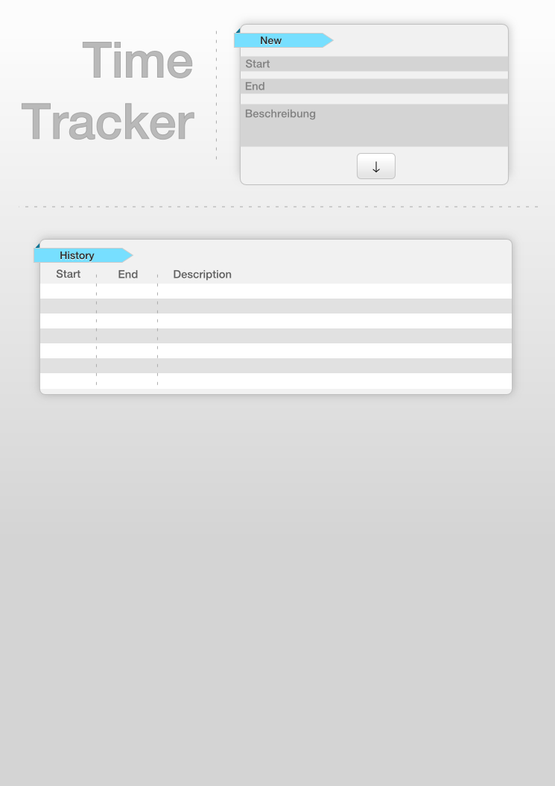

# Web Ninja Workshop - Basics

## Agenda

* Git
* HTML
* CSS
* JS
* Node.JS
* Ajax
* Wireshark
* Browser Dev Tools

## Ablauf

## Git

### Was ist Git?

* Dezentrales Versionverwaltungssystem
* Kommandozeilenwerkzeug
* [SetUp](https://help.github.com/articles/set-up-git)
* [Einleitung](http://rogerdudler.github.com/git-guide/index.de.html)

### Beispiel - TimeTracker

* Maske fuer die Erfassung von Zeiten
* Vorlage (Inkscape)

## Github

### Was ist Github?

* Social Coding Platform
* Projekthosting
* Gitintegration
* Issues
* Code-Reviews
